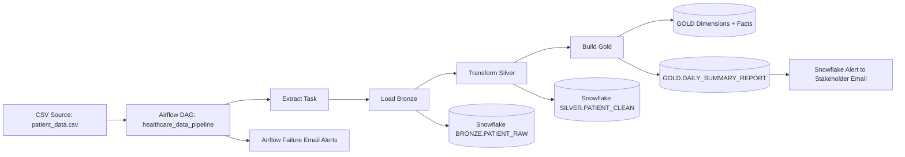
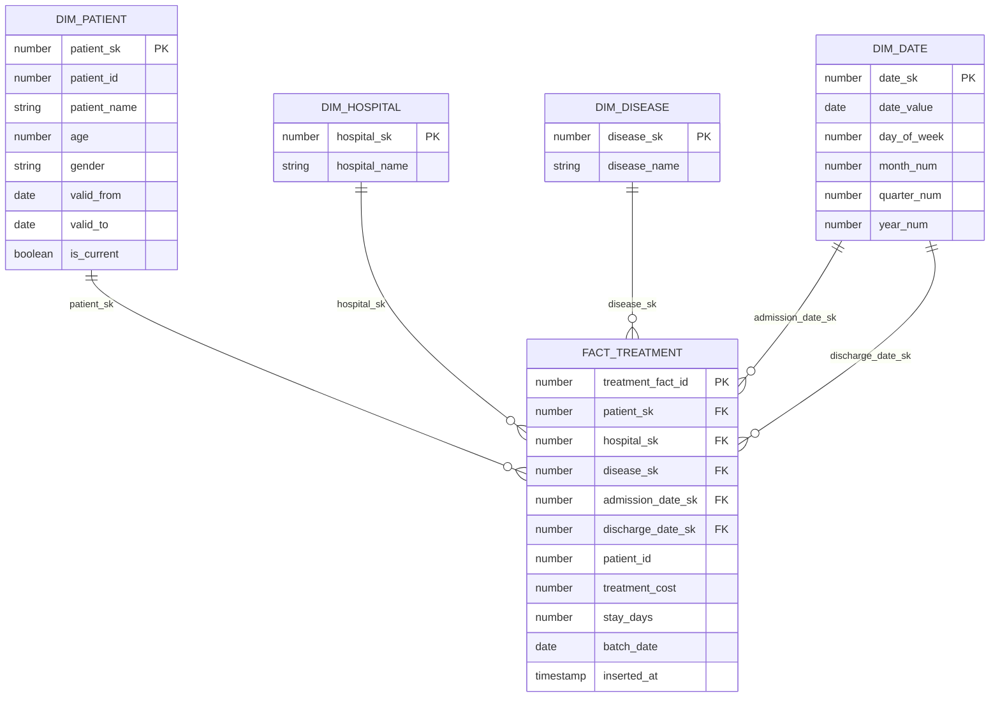

# Healthcare Medallion Capstone (Airflow + Snowflake)

End-to-end ETL pipeline for Healthcare analytics following Bronze -> Silver -> Gold Medallion architecture with idempotent orchestration, SCD Type 2, daily summary reporting, and analytics-ready star schema.

## 1. System Architecture Diagram



## 2. ER Diagram (Star Schema)



## 3. Medallion Layers

- Bronze (RAW): immutable batch snapshot in `BRONZE.PATIENT_RAW`.
- Silver (STAGING): cleaned, typed, deduplicated records in `SILVER.PATIENT_CLEAN`.
- Gold (PROD): analytics star schema in `GOLD` with facts + dimensions.

DDL files:
- `sql/bronze.sql`
- `sql/silver.sql`
- `sql/gold.sql`

## 4. SCD Type 2 Implementation

SCD2 is implemented for `GOLD.DIM_PATIENT`:
- Existing current rows are expired (`is_current = FALSE`, `valid_to = run_date`) when tracked attributes change.
- New version rows are inserted with `valid_from = run_date`, `valid_to = '9999-12-31'`, `is_current = TRUE`.

Tracked attributes: `patient_name`, `age`, `gender`.

## 5. Airflow Orchestration

DAG: `healthcare_data_pipeline`

Task flow:
1. `extract_data`
2. `load_bronze`
3. `transform_silver`
4. `build_gold`

Engineering standards implemented:
- XCom-driven modular task separation.
- Idempotency by `batch_date` (re-run safe for same logical date).
- Retry-based self-healing (`retries=2`, `retry_delay=5m`).
- Failure notifications with `email_on_failure=True`.
- Secrets through Airflow Connection `snowflake_default` (no hardcoded credentials).

## 6. Data Dictionary

### Bronze `BRONZE.PATIENT_RAW`
- `patient_id`: Source business id
- `patient_name`: Raw patient full name
- `age`: Raw age
- `gender`: Raw gender
- `hospital`: Raw hospital name
- `disease`: Raw diagnosis label
- `admission_date`: Raw admission date
- `discharge_date`: Raw discharge date
- `treatment_cost`: Raw cost amount
- `ingested_at`: Ingestion timestamp
- `batch_date`: Airflow run date
- `record_hash`: SHA2 hash for lineage/dedup support

### Silver `SILVER.PATIENT_CLEAN`
- `patient_id`: Deduped patient id
- `patient_name`: Trimmed name
- `age`: Cast to number
- `gender`: Normalized to `M`, `F`, or `U`
- `hospital`: Cleaned hospital name
- `disease`: Cleaned disease name
- `admission_date`: Valid date
- `discharge_date`: Valid date
- `stay_days`: `DATEDIFF(discharge - admission)`
- `treatment_cost`: Cast to decimal
- `batch_date`: Run date partition
- `record_hash`: Source row hash

### Gold Dimensions and Fact
- `GOLD.DIM_PATIENT`: SCD2 patient dimension
- `GOLD.DIM_HOSPITAL`: Hospital dimension
- `GOLD.DIM_DISEASE`: Disease dimension
- `GOLD.DIM_DATE`: Date dimension
- `GOLD.FACT_TREATMENT`: Fact table for treatment metrics
- `GOLD.DAILY_SUMMARY_REPORT`: Daily stakeholder summary metrics

## 7. Setup Guide

### Prerequisites
- Docker Desktop
- Snowflake account
- Database naming convention: `MBUST_<student_roll>`

### Step 1: Install Python dependencies

```bash
pip install -r requirement.txt
```

### Step 2: Generate dataset

```bash
python scripts/generate_dataset.py
```

### Step 3: Start Airflow stack

```bash
docker compose up -d
```

Airflow UI: `http://localhost:8080`

### Step 4: Create Airflow Snowflake connection

Connection ID: `snowflake_default`

Recommended fields:
- Conn Type: Generic or Snowflake
- Login: Snowflake user
- Password: Snowflake password
- Schema: `BRONZE`
- Extra JSON:

```json
{
  "account": "<account_identifier>",
  "warehouse": "COMPUTE_WH",
  "database": "MBUST_<student_roll>",
  "role": "ACCOUNTADMIN"
}
```

### Step 5: Run SQL DDL in Snowflake

Execute in order:
1. `sql/bronze.sql`
2. `sql/silver.sql`
3. `sql/gold.sql`

### Step 6: Configure Airflow email alerts

Set SMTP in Airflow config/env so `email_on_failure` sends notifications.

### Step 7: Trigger DAG

Run `healthcare_data_pipeline` from Airflow UI.

## 8. Success Reporting and Snowflake Alert

Pipeline writes daily metrics to `GOLD.DAILY_SUMMARY_REPORT`.

A ready-to-use Snowflake Alert template is included in `sql/gold.sql`.
Replace:
- `YOUR_NOTIFICATION_INTEGRATION_NAME`
- recipient email

Then activate alert in Snowflake.

## 9. Snowsight Dashboard (Required Manual Step)

Create dashboard with KPIs from Gold tables, e.g.:
- Total treatment cost by disease
- Average stay days by hospital
- Daily admitted/discharged trends
- Top hospitals by patient volume

## 10. Code Quality and Pre-Commit

Configured tools:
- `black`
- `flake8`
- `check-yaml`

Run locally:

```bash
pre-commit install
pre-commit run --all-files
```

## 11. Submission Checklist

- Medallion architecture complete (Bronze/Silver/Gold).
- At least 1 Fact and 3+ Dimensions in Gold.
- SCD2 implemented for one core dimension.
- DAG idempotent and rerunnable by date.
- No hardcoded secrets (Airflow Connection based).
- Failure email alerts configured.
- Daily summary generated and Snowflake Alert configured.
- Snowsight dashboard created.
- Secure share created for instructor account.
